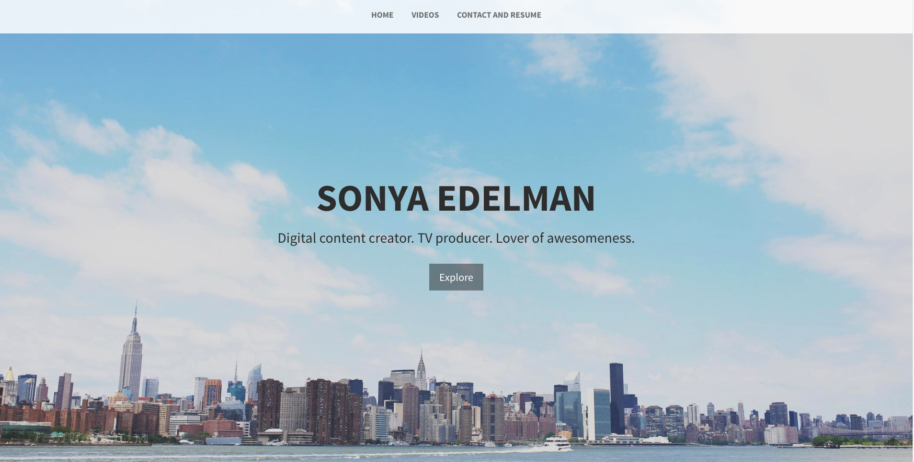
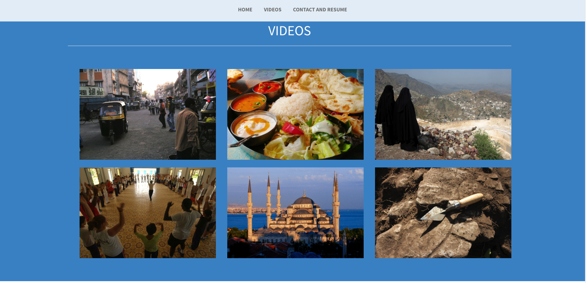

A Minimal Portfolio Website
============================

## A portfolio website

This is a website built using jQuery and Bootstrap. It's main purpose was to showcase demo reels and videos. It includes a landing page, video portfolio section, and a contact and resume section.

---

### Landing section

### Videos section

---

## Tools and libraries

HTML, CSS, Grunt, Modernizr, SmoothScroll.js, jQuery, and JavaScript

